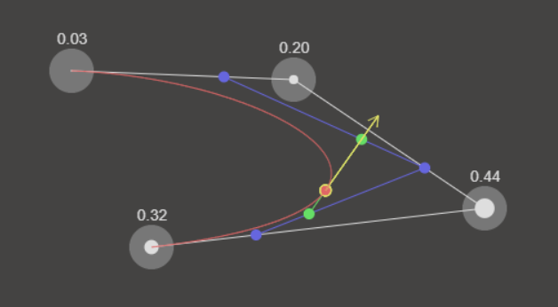
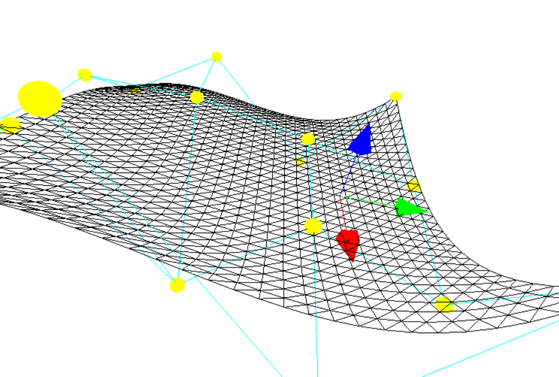
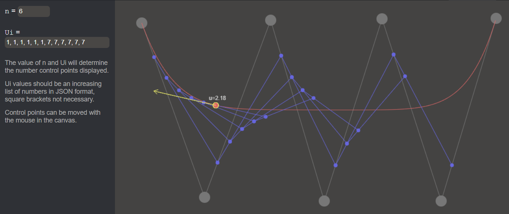
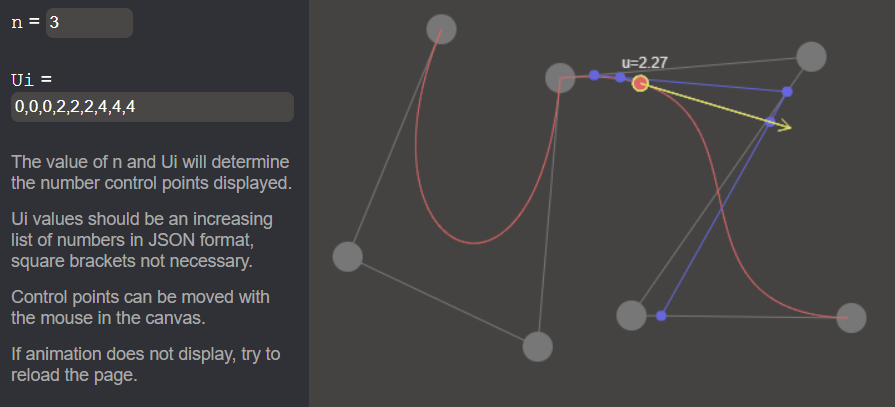
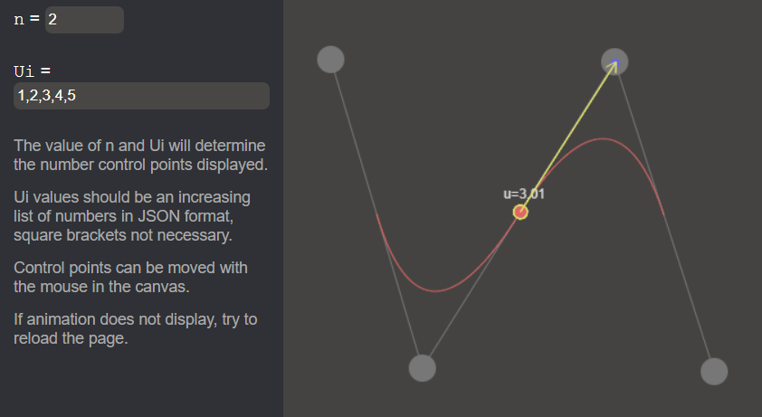
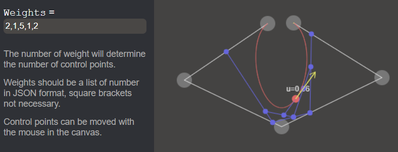

# GM - Project Work

Project Work for MIN-GM, **Group Yellow**.

## 1. Introduction

This repository contains all files for the MIN-GM project, winter semester 2022/2023, group Yellow.
It contains a web page and js script files implementing Bézier curves, Bézier Surfaces, B-Splines and NURBS, as well as test files.

This README file is the documentation of our project.

### Run

Open `./src/index.html`, no need of web-server.

### Architecture

- `src`
    - `exercise1` All files for Bézier Curves
    - `exercise2` All files for Bézier Surfaces
        - `dist` All TypeScript code for Bézier Surfaces
        - `src` Already transpiled JavaScript code
    - `exercise3` All files for B-Splines
    - `exercise4` All files for NURBS
    - `script` Contains JS glue as a minimal framework
        - `canvasDrawer.js` contains functions to easily draw points, lines, arrows into the canvases
        - `framework.js` handles the switch between pages, no official framework is used though, just some JS glue
    - `index.html` Final project elements
    - `style.css` Style for single HTML page

### Code

The code is commented in English. We implemented all algorithms by our own following the lecture's slides.

### Members of Yellow Group and work repartition

- **Mario Vieilledent** took care of 2D implementation of algorithms for Bézier Curves, B-Splines and NURBS using HTML canvas and JavaScript.
- **Hesse Henri** adapted the algorithms for 3D spaces using the library `three.js` with TypeScript. 

## 2. Bézier Curve

> Core file for this exercise is `./src/exercise1/Bezier_Curves.js`

There's a test file for Bézier Curves that executes some tests and display the results into the console.

### Language & features

Raw JavaScript is used, HTML canvas for drawing points and lines in web page.

The 4 control points can be moved by the mouse in the canvas.

Are displayed:
- Control points and polygon
- Intermediate points and lines
- Bézier curve
- An animation showing
    - a moving point
    - its tangent vector
    - Bernstein polynomials values applied for each point at a variable t

### Casteljau’s algorithm

This pretty formula is to prove the power of markdown.
$$B_j^n(t)=\binom{n}{j}t^j(1-t)^{n-j}$$

## 3. Bézier Surface

> Core file for this exercise is `./src/exercise2/src/Bezier.ts`

There is as well unit tests, `npm run test`.

### Language & features

Made in TypeScript with `three.js`.

### Build js dest file

JS script is already transpiled into an out js file. Otherwise, install dependencies and run project, in the `./src/exercice2` folder:

> `npm install`
> `npm run build`

Open either with`./exercise2/dist/index.html` for test, or `./src/index.html` on page `3. Bézier Surfaces`.

### Test

To check unit tests, in the `./src/exercice2` folder:

> `npm run test`

## 4. B-Splines

> Core file for this exercise is `./src/exercise3/B_Splines.js`

### Features

There's two input values:
- `n` for specifying the degree of B-Spline
- `Ui`, the list of u values, is checked to be an increasing (or equal) list of numbers

These two inputs determine the number of control points (Di in code). They are placed right above their corresponding epsilon abscissae, at a random height. They are recalculated for each modification of input.

An abscissae is drawn under the B-Spline displaying `Ui` values and `Epsilons` with small triangles.

It is possible to move the control points with the mouse.

Are displayed:
- Control points and polygon
- Intermediate points and lines *(if `n=2`, there will be only one intermediate line at once)*
- B-Spline curve
- An animation showing
    - a moving point
    - its tangent vector

### C0 continuity

It is interesting to change parameters to observe tangent vector behavior at the point in the middle, where we can see a break in the curve, so we can feel the C0 continuity.

The following example behave like two Bézier Curves of degree 3 with a common point placed so it is only C0 continuous.

### C1 continuity

In the following example we can see the tangent vector suddenly changing its "moving direction". At the point `u=3`, the curve is C1 continuous.

## 5. NURBS

> Core file for this exercise is `./src/exercise4/NURBS.js`

There is a test file for NURBS, its result is displayed in the console.

### Features

There is only one input: the list of weights. The number of weights determine both the number of control points (randomly placed) and the n value.

It is possible to move the control points with the mouse.

Are displayed:
- Control points and polygon
- Intermediate points and lines
- The curve NURBS
- An animation showing
    - a moving point
    - its tangent vector

## Outcome

*Through this project as well as the lecture sessions, I have made many discoveries and learnt a lot. I was able to understand the mathematics of the curves we learned, but also to put them into practice in a code project, which I think is necessary to assimilate any notion.*

*I can now understand how the majority of curves are constructed and managed in drawing softwares, modeling softwares, and video games, but I am also able to understand the underlying mathematics and construct the curves myself.*

*I am very happy to discover this branch of computer science related to mathematics, which I had always heard about but never went deeper into it.*

*Thank you for the courses. Mario Vieilledent.*